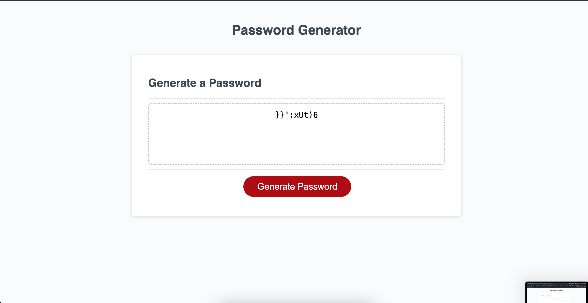

# password-generator

Working on this project I had the chance to create my first password's generator in Javascript. The project is linked to GitHub.

I have learned how to make new operations using Javascript.
Defintely learing new tools that I am going to use in my next projects.

The deployed version you can find here: https://costagiu.github.io/password-generator

## Usage

  
To open the webpage open index.html in your webbrowser. It should look like this:

Credits

I used W3Schools as a reference for Javascript.

I used codingbootcamp as a guide to write this README.

.